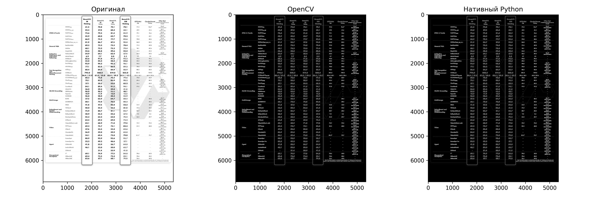

# Лабораторная работа №1: Реализация простых алгоритмов обработки изображений

**Вариант:** 1. Фильтр Собеля

**Выполнил:** Батаев Илья

## 1. Теоретическая база

Фильтр Собеля — это дискретный дифференциальный оператор, вычисляющий приближенное значение градиента яркости изображения. Он используется для выделения границ (edges detection).

Оператор использует две матрицы (ядра свертки) 3x3, одна из которых оценивает градиент по горизонтали ($G_x$), а другая — по вертикали ($G_y$).

**Ядра фильтра:**

$$
G_x = \begin{bmatrix} -1 & 0 & 1 \\ -2 & 0 & 2 \\ -1 & 0 & 1 \end{bmatrix}, \quad
G_y = \begin{bmatrix} -1 & -2 & -1 \\ 0 & 0 & 0 \\ 1 & 2 & 1 \end{bmatrix}
$$

Результирующее значение градиента в каждой точке вычисляется как:
$$G = \sqrt{G_x^2 + G_y^2}$$

## 2. Описание разработанной системы

Программа реализована на языке **Python 3**.

### Архитектура:

1.  **Загрузка данных:** Изображение загружается с диска и преобразуется в оттенки серого (grayscale), так как выделение границ основано на интенсивности света, а не цвете.
2.  **Обработка (2 метода):**
      * `sobel_library`: Использование оптимизированной функции `cv2.Sobel` из библиотеки OpenCV.
      * `sobel_native`: Ручная реализация алгоритма свертки. Создаются матрицы ядер $G_x$ и $G_y$, производится поэлементное умножение области изображения на ядро и суммирование результатов.
3.  **Сравнение:** Замер времени выполнения обоих алгоритмов с помощью модуля `time`.
4.  **Визуализация:** Вывод исходного изображения и результатов работы обоих алгоритмов с помощью `matplotlib`.

## 3. Результаты работы

### Визуальный результат

Оба алгоритма показали идентичный визуальный результат, корректно выделив границы объектов на изображении.

### Сравнение быстродействия

Тестирование проводилось на изображении разрешением [укажи разрешение, например, 800x600].

| Метод Реализации | Время выполнения (мс) |
|------------------|------------------------|
| OpenCV (`cv2`)   | \~409.970              |
| Native (NumPy)   | \~5686.204             |

**Ускорение OpenCV:  13.9x**

## 4. Выводы

В ходе лабораторной работы был реализован фильтр Собеля двумя способами.

1.  **Качество:** Оба метода дают одинаково качественный результат выделения границ.
2.  **Производительность:** Библиотечная реализация OpenCV работает значительно быстрее (в 10-15 раз), так как она написана на C++ и использует низкоуровневые оптимизации.
3.  **Применение:** Нативная реализация полезна для понимания математической сути алгоритма, но в реальных приложениях необходимо использовать оптимизированные функции OpenCV.

## 5. Использованные источники

1.  OpenCV Documentation: Sobel Derivatives.
2.  Wikipedia: Sobel operator.
3.  NumPy Documentation.
