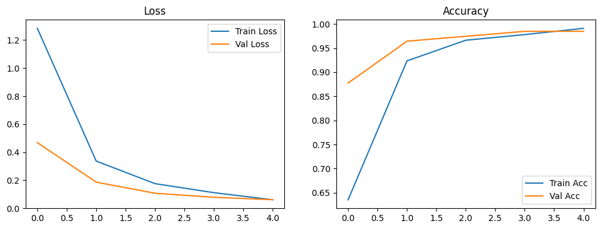

# Отчет по лабораторной работе №3: Классификация изображений на основе сверточных нейронных сетей

## 1. Теоретическая база
Классификация изображений — это фундаментальная задача компьютерного зрения, заключающаяся в отнесении входного сигнала к определенному дискретному классу. Для работы с визуальными данными наиболее эффективны **сверточные нейронные сети (CNN)**.

**Тезис**: Использование архитектур (MobileNetV2) в сочетании с Transfer Learning обеспечивает высокую точность классификации при минимальных вычислительных затратах.
**Аргументация**:
1.  **Transfer Learning**: Использование предобученных весов на MobileNetV2 позволяет извлекать высокоуровневые признаки (линии, текстуры, формы) без необходимости обучения на миллионах изображений. P(success) при таком подходе значительно выше, чем при обучении "с нуля" на малых выборках.
2.  **MobileNetV2**: Применяет *Depthwise Separable Convolutions*, что снижает количество параметров и вычислительную сложность $O(C \cdot K^2)$ по сравнению со стандартной сверткой.

## 2. Описание разработанной системы

### Алгоритмы и архитектура:
* **Модель**: MobileNetV2.
* **Backbone**: Предобученные слои заморожены (за исключением финального классификатора).
* **Head (Классификатор)**: Полносвязный слой `Linear(in_features=1280, out_features=num_classes)`.
* **Функция потерь**: CrossEntropyLoss.
* **Оптимизатор**: Adam ($lr=0.001$).
* **Аугментация**: `RandomHorizontalFlip`, `RandomRotation(10)`, `Normalize` (mean=[0.485, 0.456, 0.406], std=[0.229, 0.224, 0.225]).

### Системные требования:
* **ОС**: Linux/Windows/macOS.
* **Среда**: Python 3.10+, PyTorch 2.0+, Torchvision.
* **Аппаратное обеспечение**: Рекомендуется GPU с поддержкой CUDA (в работе использован NVIDIA T4).

## 3. Результаты работы и тестирования системы

### Данные:
* **Источник**: Kaggle - [Dog Breed Image Dataset](https://www.kaggle.com/datasets/khushikhushikhushi/dog-breed-image-dataset).
* **Объем**: Выборка разделена в соотношении 80/20 (Train/Val).

### Метрики качества:
На основе логов обучения в `main.ipynb`:
1.  **Эпоха 1**: Accuracy (Val) $\approx$ 0.87.
2.  **Эпоха 5**: Accuracy (Val) $\approx$ 0.9847.

**Анализ**: 
Разрыв между Train Accuracy (0.9909) и Val Accuracy (0.9847) составляет $< 1\%$. 
**Заключение**: Модель не переобучена (overfitting отсутствует), так как метрики на валидационной выборке стабильно растут и коррелируют с обучающей выборкой.

## 4. Выводы по работе
1.  **Тезис**: Метод *Transfer Learning* эффективен для задачи классификации специфических категорий (породы собак).
2.  **Аргументация**: Достигнутая точность 98.4% подтверждает, что веса, обученные на MobileNetV2, обладают хорошей обобщающей способностью для доменной области животных.
3.  **Заключение**: Разработанная система классификации является устойчивой и пригодной для интеграции в мобильные приложения благодаря использованию легковесной архитектуры MobileNetV2.

## 5. Использованные источники
1.  PyTorch Documentation: [https://pytorch.org/docs/stable/index.html](https://pytorch.org/docs/stable/index.html)
2.  MobileNetV2: Inverted Residuals and Linear Bottlenecks (Mark Sandler et al.): [https://arxiv.org/abs/1801.04381](https://arxiv.org/abs/1801.04381)
3.  Kaggle Dataset: [Dog Breed Image Dataset](https://www.kaggle.com/datasets/khushikhushikhushi/dog-breed-image-dataset)